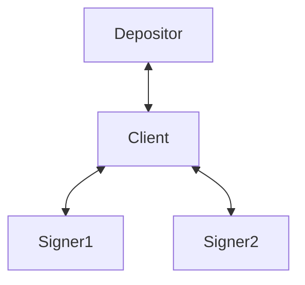
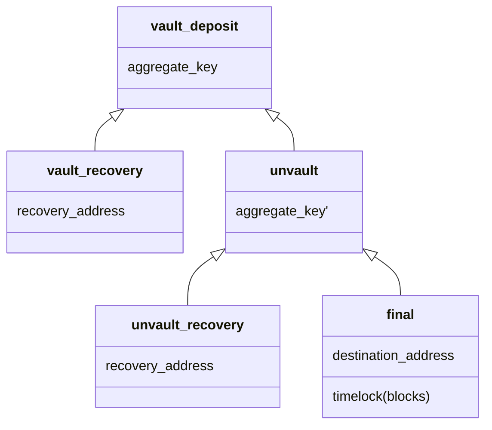

## Vaults using blind co-signers

### Background
Consult [Blinded Musig2](https://github.com/halseth/ephemeral-signing-service/blob/main/doc/general.md)
for background on the blinded signature scheme.

## Introduction

Vaults are a much sought after feature in Bitcoin that many believe finally
would make safe self-custody practical for the regular Joe.

A construction that is possible on Bitcoin today is using a co-signer together
with some sort of second-factor authentication and transaction policy to
emulate vault-like behaviour. This is a secure and user-friendly setup that is
deployed successfully by many of the largest custodians today.

The main drawback with this setup is that the co-signer gains perfect insight
into the users transactional activity, policy and holdings. Depending on the
setup, the co-signer might also have the ability to freeze the user's funds or
making them inaccessible in case they disappear.

In this post we aim to mitigate these problems by outsourcing the signing to
semi-trusted signing servers, eliminating any single points of failure by
having them engage in a blinded multi-signature protocol scheme. 

In order to ensure that blinded messages are well-formed, and to encode a
transaction policy the signers can enforce without giving up privacy,
zero-knowledge proofs will play a key role.

## Setup
The protocol will involve these actors:
- **Depositor**: the software or hardware entity controlling the keys to the
  coins that are to be deposited into the vault.
- **Client**: the aggregation software that is responsible for building the
  transaction graph, communicating with the signers and deriving blinding
  factors.
- **Signer**: Semi-trusted software agent that will blindly sign messages sent
  by the client using a key they control. It can also enforce transaction
  policies using a ZK verifier agreed on when the vault us first created.

## High-level protocol overview
With a blinded signing scheme in place we can build a safe and practical vault
implementation by passing PSBTs around.

1. The depositor creates a PSBT specifying inputs for the vault deposit
   transaction, as well as the amount for the vault output and any change
   outputs.

2. The PSBT is sent to the client, along with a recovery address and an unvault
   timelock setting.

3. The client sets up signing sessions with the signers, passing along a
   commitment to the vault parameters.  

4. Using the public keys of the signers, the client creates the aggregate
   public key that funds will be sent to.

5. The client builds the vault recovery transaction that will spend from the
   aggregate public key back to the recovery address.

6. The client generates a second aggregate public key for the unvault output
   and constructs the unvault transaction.

7. The client builds the unvault recovery transaction that will spend from the
   unvault output back to the recovery address.

8. The client sends blinded variants of the three transactions (vault recovery,
   unvault, unvault recovery) to the signers along with ZK proofs proving that
   the blinded messages are well-formed.
   (Note: in the current implementation, the unvault tx is signed with the
   final tx, there is a todo to move this to be presigned during the vaulting
   step).

9. Each signer will respond with partial signatures for the transactions
   using different nonces for each.

10. The client verifies that the transaction graph is valid and fully signed,
    before returning them to the depositor.

11. The depositor receives the final PSBT with the vault output key filled and
    the pre-signed transactions from the client. It can now verify the setup
    and sign the deposit and move the funds to the vault, knowing it has
    recovery options for both the vault and unvault states.

### Security
The security of the setup relies on the assumption that _at least one of the
signers_ act according to the protocol. This is most easily ensured by the
holder running one of the signers themselves.

An attacker wanting to take control of the funds, would need to either

1) gain control of all signers, having them sign a transaction spending the
funds to the attacker's address.

2) take control of the client software, and trigger an unvault to the
attacker's address. In this case the attacker relies on the unvault not being
noticed by the depositor, such that the unvault recovery transaction can be
broadcast.

3) gain control of the keys for the recovery address, then get the user to
trigger a recovery. In other words, it is important that the recovery address is
a safe cold-storage destination or custodian.

### Failure scenarios
In addition to key theft, there's a few failure scenarios the architecture is
designed to handle.

- If one or more of the signers disappear before the final transaction has been
  signed, one can always broadcast one of the recovery transactions to reclaim
  the money from the vault.

- If one of the signers refuses to sign the final transaction (for any reason),
  the user can also in this case reclaim the money by using the recovery
  transcation.

- If at most N-1 of the signers are compromised, they cannot create a valid
  signature for the aggregate public key, and the worst thing they can achieve
  is to refuse to sign a legit unvault request (see above scenario).

- If the client software is compromised, the attacker can learn who the
  signers are, and unblind any message sent to them. This means that the user
  has their privacy compromised. The attacker cannot easily steal the money in
  the vault, however, since the depositor always has their recovery
  transactions in case of an unauthenticated unvault.

### ZK proofs
We attach up to two ZK proofs with the transaction signing requests sent to the
signers. 

The initial signing request for the two recovery transactions and unvault
transaction contains a single proof per transaction, proving that the messages
are blinded according to the protocol outlined in the [blinded
Musig2](https://github.com/halseth/ephemeral-signing-service/blob/main/doc/general.md)
writeup. We don't need to prove more about these tranasctions since the
depositor can verify them before deciding to deposit into the vault

Essentially what is proved is that the values contributed by the individual
signer (pubkey, public nonce) are part of the aggregation leading to the final
blinded key and message.

For the last, finalization transaction the client will attach an additional
proof, proving to the signers that the transaction is timelocked according to
the policy committed to when the vault was created.
