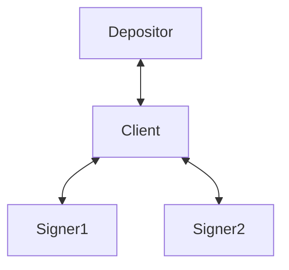

## Vaults using blind co-signers

### Background
Consult [Blinded Musig2](https://github.com/halseth/ephemeral-signing-service/blob/main/doc/general.md)
for background on the blinded signature scheme.

## Introduction

Vaults are a much sought after feature in Bitcoin that many believe finally
would make safe self-custody practical for the regular Joe.

A construction that is possible on Bitcoin today is using a co-signer together
with some sort of second-factor authemntication and transaction policy to
emulate vault-like behaviour. This is a secure and user-friendly setup that is
deployed successfully by many of the largest custodians today.

The main drawback with this setup is that the co-signer gains perfect insight
into the users transactional activity, policy and holdings. Depending on the
setup, the co-signer might also have the ability to freeze the users funds or
making them inaccessible in case of bankcrupty.

In this post we aim to mitigate these problems by outsourcing the signing to
semi-trusted signing servers, eliminating any single points of failure by
having them engage in a blinded multi-signature protocol scheme. 

In order to ensure that blinded messages are well-formed, and that encoding a
transaction policy the signers can enforce without giving up privacy,
zero-knowledge proofs will play a key role.

## Setup
The protocol will involve these actors:
- **Depositor**: the software or hardware entity controlling the keys to the
  coins that are to be deposited into the vault.
- **Client**: the aggregation software that is responsible for building the
  transaction graph, communicating with the signers and deriving blinding
  factors.
- **Signer**: Semi-trusted software agent that will blindly sign messages sent
  by the client using a key they control. It can also enforce transaction
  policies using a ZK verifier agreed on when the vault us first created.

## High-level protocol overview
With a blinded signing scheme in place we can build a safe and practical vault
implementation by passing PSBTs around.

1. The depositor creates a PSBT specifying inputs for the deposit transaction,
   as well as the amount for the vault output and any change outputs.

2. The PSBT is sent to the client which sets up signing sessions with the
   signers.

3. Using the public keys of the signers, the client creates the aggregate
   public key that funds will be sent to. 

4. The client builds the recovery transaction that will spend from the
   aggragate public key. 

5. With the transaction created, the client sends a blinded variant of it to
   the signers.

6. Each signer will respond with a partial signature for their key.

7. The client verifies that the recovery transaction is valid for spending the
   vault output.

8. The depositor receives the final PSBT with the vault output key filled and
   the pre-signed recovery transaction from the client. It can now sign the
   deposit and move the funds to the vault.

### Details

1) The holder wanting to deposit into a vault starts by contacting a set of
signer servers, to get their public keys and nonces.

Using this he creates a public key that is a Musig2 aggregate key of the
signers.

Using this key as the output, the client creates an unsigned transaction that
has this as its only output.

2) The signers are then asked to sign a spend tx from this output, spending the
full amount back to a recovery address. Together with this signing request, the
client attaches a ZK proof that proves that the recovery tx does exactly this
(spend whole amount into a hardcoded recovery address). This recovery address
is static for the whole vault lifetime, but not revealed to the signers.

Now that the client has this pre-signed spend transaction, it is safe to sign
the deposit tx and send the coins into the control of the signer quorum.

To unvault the funds, the owner will get a tweak the output aggregate key of 
the signers, and create an unvault tx that spends the funds to this public key.

Two spends from the unvault tx is created: one recovery tx and another spend tx
that is timelocked and spends the funds to the final destination. 

3) These txs and proof is sent to the signers who will validate that they are
indeed correctly crafted, then sign them.
